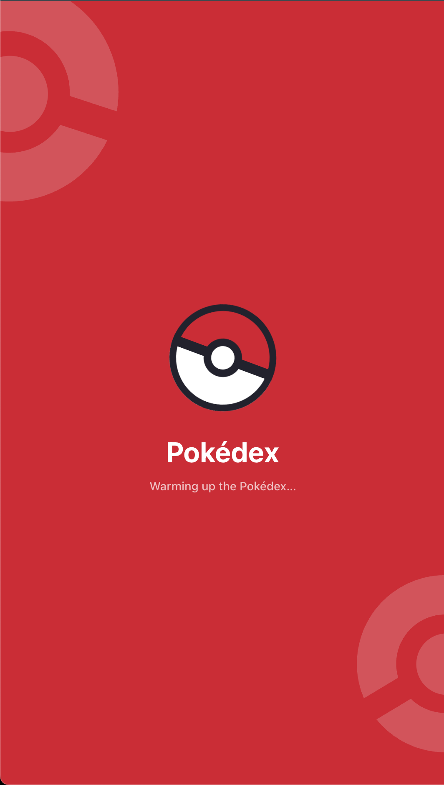
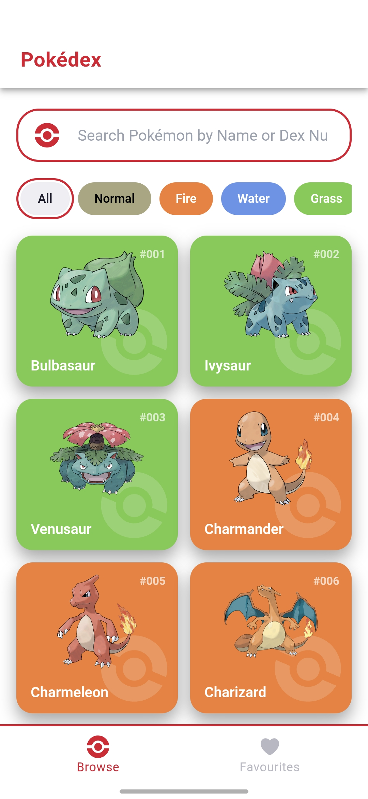
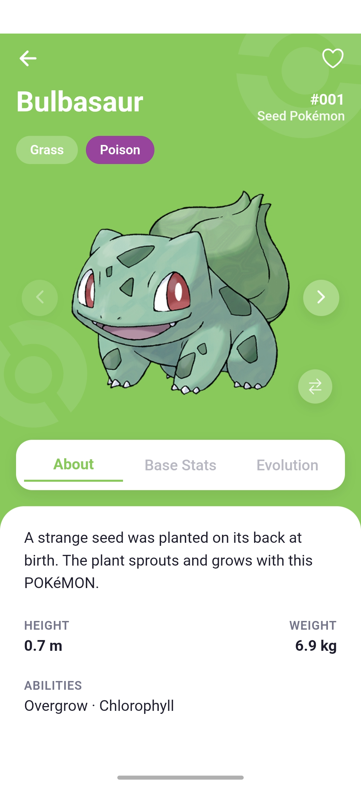
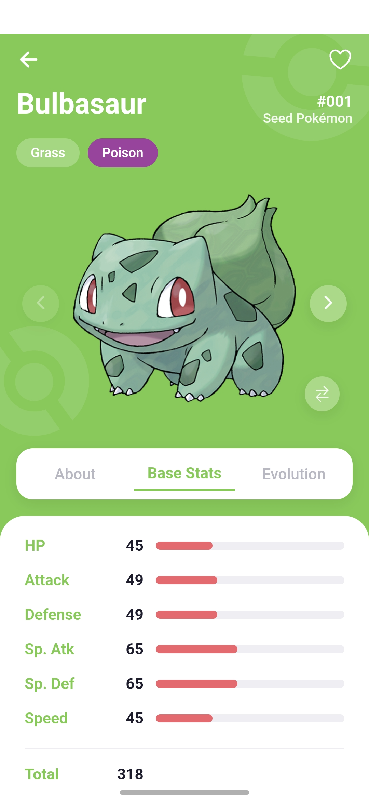
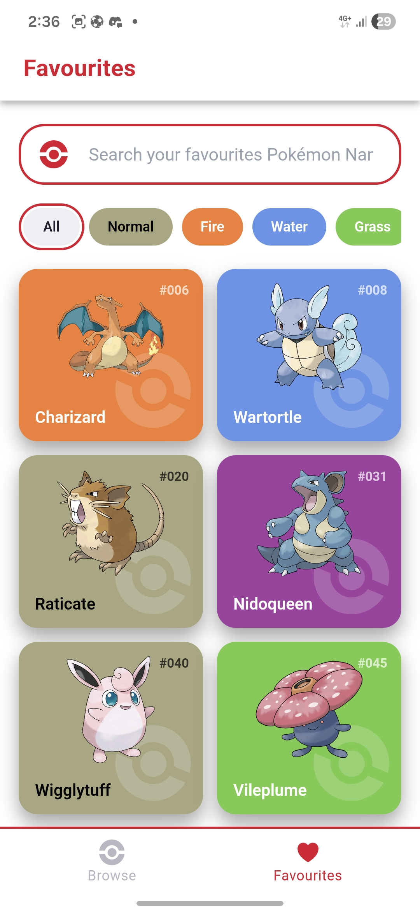

<h1 align="center">Pokédex</h1>

<p align="center">
  <a href="https://pokedex-sample.vercel.app/"></a>
  
  
  
  
</p>

<p align="center">
A mobile-first Pokédex built with <b>Angular 22</b> and <b>Ionic 9</b>, standalone and zoneless,
state in <b>signals</b>, persistence in <b>Ionic Storage</b>, wrapped for Android with
<b>Capacitor 8</b>, and tested with <b>Vitest</b>. One codebase, two targets, no backend of our
own. All data comes from the open <a href="https://pokeapi.co">PokeAPI</a>.
</p>

<p align="center">
  <b>▶ Live app: <a href="https://pokedex-sample.vercel.app/">pokedex-sample.vercel.app</a></b>
</p>

## Screens

| Splash | Browse | Detail · About | Detail · Stats | Favourites |
|---|---|---|---|---|
|  |  |  |  |  |

## What it does

Every row is a use case in the [PRD](docs/PRD.md), with acceptance criteria you can check against
the running app.

| | Feature | Notes |
|---|---|---|
| ✅ | **Browse the whole dex** ([UC-1](docs/PRD.md#uc-1--browse-pokémon-with-infinite-scroll)) | 1351 entries on infinite scroll, 1025 base Pokémon plus 326 alternate Forms. Cards carry artwork, name, number, and Type colour, with no per-card request |
| ✅ | **Detail with three tabs** ([UC-2](docs/PRD.md#uc-2--view-pokémon-detail-tabs--swipe-navigation)) | A fixed hero (artwork, front/back sprite toggle, Types, Favourite) over tap-switched About, Stats, and Evolution tabs. Evolution is lazy-loaded |
| ✅ | **Swipe between Pokémon** ([UC-2](docs/PRD.md#uc-2--view-pokémon-detail-tabs--swipe-navigation)) | Horizontal swipe and arrows move to the previous/next entry, with the neighbour prefetched |
| ✅ | **Jump through an evolution line** ([UC-2](docs/PRD.md#uc-2--view-pokémon-detail-tabs--swipe-navigation)) | Tapping a stage opens that Pokémon's detail, stacking so back returns where you were |
| ✅ | **Images with graceful failure** ([UC-3](docs/PRD.md#uc-3--view-pokémon-images)) | Official artwork everywhere, a placeholder instead of a broken-image icon, alt text throughout |
| ✅ | **Favourites that persist** ([UC-4](docs/PRD.md#uc-4--favourite-pokémon-and-view-favourites)) | Saved on-device via Ionic Storage. The tab renders with zero network requests, and also filters by Type and searches within |
| ✅ | **Filter by Type** ([UC-5](docs/PRD.md#uc-5--filter-by-type)) | One of the 18 Types at a time, still on infinite scroll |
| ✅ | **Search by name or number** ([UC-6](docs/PRD.md#uc-6--search-by-name-or-number)) | Partial match against a name index loaded once at startup, debounced, with in-flight requests cancelled |
| ✅ | **Every state covered** | Loading, empty, error-with-retry, offline, and not-found, for each view. The [State Matrix](docs/PRD.md#61-state-matrix) is the checklist |

## Running it

There is no backend to start, no database to migrate, and no API key to get hold of. The app talks
straight to the public PokeAPI, so all you need is Node and a connection.

### What you need

**Node 22.** The exact version is pinned in `.nvmrc` as 22.23.3. If you use
[nvm](https://github.com/nvm-sh/nvm), `nvm use` in the project root picks it up, and `nvm install`
first if you do not have that version yet. Without nvm, install Node 22 however you normally do.
Angular 22 rejects anything below 22.22.3 and tells you so plainly, so a wrong version fails loudly
rather than strangely.

**npm** comes with Node, and anything from npm 10 onwards is fine.

That is the whole list. Nothing else to install, configure, or sign up for.

### Three commands

```bash
nvm use      # or just check that node -v reports 22.x
npm ci       # installs the exact versions in package-lock.json
npm start    # dev server on http://localhost:4200
```

`npm ci` rather than `npm install` on purpose, so you get the versions this was built and tested
against instead of whatever has been published since.

### What you should see

Open <http://localhost:4200> and you land on Browse. A skeleton grid shows first, then the cards.

The cards arrive neutral grey and take on their Type colour a moment later. That is deliberate, not
a glitch: the colours come from a background warm-up that runs off the scroll path, explained
[under the hood](#what-happens-on-startup). The search box is disabled for the same couple of
seconds while the name index loads, then enables itself.

From there, scroll to the bottom to pull the next page, tap a card to open its detail, swipe
sideways on a detail to move to the next Pokémon, and tap the heart to favourite one. Favourites
appear in the second tab and are still there after a reload.

### Checking it yourself

```bash
npm test       # the unit tests, all 252 should pass
npm run build  # production bundle into dist/pokedex/browser
```

That build output is exactly what Vercel serves and what Capacitor copies into the Android project.
More on the test layout is [further down](#tests).

### If something goes wrong

**The dev server dies with `EMFILE`.** That is macOS, where the default `kern.maxfilesperproc` of
10240 is below what the file watcher wants. Poll instead of watching:
`npm start -- --poll 3000`.

**An Angular version error on `npm start`.** Node is below 22.22.3. Run `node -v` and go back to
the first step.

**Port 4200 is taken.** `npm start -- --port 4300`.

**`npm ci` complains about the lockfile.** That means `package.json` and `package-lock.json`
disagree, which should not happen on a clean clone. `npm install` will work around it, at the cost
of possibly resolving newer versions than these were tested with.

**The cards stay grey, or search never enables.** Both depend on PokeAPI requests, so check the
connection. Browse itself carries on working either way.

Android needs a real toolchain, and it is [further down](#android).

## How it is put together

Three layers, and calls only go downward.

```
┌────────────────────────────────────────────────────────────────┐
│ PRESENTATION   pages + components (Ionic)                      │
├────────────────────────────────────────────────────────────────┤
│ APPLICATION    services holding state (Angular signals)        │
├────────────────────────────────────────────────────────────────┤
│ DATA           repository, API client, cache, mappers, storage │
└────────────────────────────────────────────────────────────────┘
```

Presentation never imports `HttpClient` or the API client, and the data layer never imports a
component. That rule is lint-enforced with `eslint-plugin-boundaries`, so an upward import fails
the build rather than quietly rotting. It also means the cache's backing store can go from a test
fake to Ionic Storage to native SQLite without the floors above noticing.

State lives in signals. RxJS is still here, but only for what it is genuinely good at, which is
HTTP, debouncing the search box, and cancelling requests that are no longer wanted.


### What is in `package.json`

Short on purpose. Every runtime dependency below is doing a job the platform does not already do,
and the ones that would normally show up in a project like this (a state library, an HTTP client,
a component kit, an image loader) are absent because Angular and Ionic already cover them.

- [Angular 22](https://angular.dev) for the framework, standalone and zoneless, with `HttpClient`
  for the network and the router for navigation
- [Ionic 9](https://ionicframework.com) for the mobile UI layer, its theming variables, and the
  platform behaviours worth not rewriting, such as infinite scroll and the tab bar
- [Capacitor 8](https://capacitorjs.com) to wrap the same web build as a native app, plus its
  `app`, `network`, `splash-screen`, and `status-bar` plugins for the four native seams the app
  actually touches
- [Ionic Storage](https://github.com/ionic-team/ionic-storage) for persistence, which is IndexedDB
  on the web and can become native SQLite without the layers above noticing
- [RxJS](https://rxjs.dev) for HTTP, debounce, and cancellation, and nothing else
- [Ionicons](https://ionic.io/ionicons) for the icon set

On the dev side, [Vitest](https://vitest.dev) for tests, ESLint with
[eslint-plugin-boundaries](https://github.com/javierbrea/eslint-plugin-boundaries) for the
layering rule, Prettier, and [sharp](https://sharp.pixelplumbing.com) in the icon script.

[ARCHITECTURE.md](docs/ARCHITECTURE.md) has the full picture and the reasoning behind each choice.

## The parts that were actually hard

PokeAPI is pleasant to work with until you reach the alternate Forms, and then it has opinions.

The first is that a Pokémon's **entry id is not its species id**. `/pokemon/10001` is Deoxys
Attack Forme, but `/pokemon-species/10001` does not exist, because species and evolution data are
keyed by species. So `getSpecies(entryId)` works perfectly for the first 1025 Pokémon and then
404s on all 326 Forms. The fix is not clever, it is just taking the two ids seriously as separate
things in the domain model so the call you want is the only one available
([ADR 0008](docs/adr/0008-entry-id-vs-species-id.md)).

The second is that the ids are not contiguous. After 1025, the next entry is 10001. Any
prev/next built on `id + 1` falls straight into that gap, so navigation walks the index by
position instead ([ADR 0004](docs/adr/0004-navigate-by-list-order-not-id-arithmetic.md)).

Then there is the browse grid. The list endpoint returns names and urls and nothing else, so
there is no Type on a card and therefore no colour, but a request per card would wreck the
scroll. Browse keeps paging the list endpoint and a background Type map fills the colours in
reactively as it arrives, which is why cards start neutral and warm up a beat later
([ADR 0001](docs/adr/0001-hybrid-loaders-behind-one-source.md),
[ADR 0006](docs/adr/0006-background-type-map-for-coloured-browse-cards.md)). The tempting
simplification, folding the name index into that same Type map, is deliberately not taken, since
one failed request would then silently drop Pokémon out of search
([ADR 0007](docs/adr/0007-name-index-separate-from-type-map.md)).

The cache earns its complexity from the data rather than from taste. Pokémon reference data never
changes, so there is no TTL and a reopen is instant. A version key means a shape change can
invalidate everything at once, and Favourites sit in a separate store so they are never caught by
that ([ADR 0003](docs/adr/0003-async-cache-seam.md)). How a read actually resolves is
[below](#under-the-hood).

The rest of the choices were smaller. Signals instead of NgRx, because the state here is small and
mostly local ([ADR 0005](docs/adr/0005-signals-over-ngrx.md)). Vitest instead of Jest, because it
shares Vite with the Angular build and one transform pipeline beats two
([ADR 0009](docs/adr/0009-vitest-over-jest.md)). All nine ADRs are in [docs/adr/](docs/adr/).

## Under the hood

### Which way the data flows

Actions go down, state comes back up as signals. A component never awaits a fetch and never holds
a loading boolean of its own. It calls a method and renders whatever the service's signals say.

```
   ACTION                                                            STATE
   tap · scroll · type · favourite                                   signals

   BrowsePage · DetailPage · FavouritesPage  ─────────────►  the same pages,
            │                                                reading signals
            │  loadNext()  showSearch(q)  showByType(t)             ▲
            │  load(entryId)  toggle(entry)                         │
            ▼                                                       │
   ┌──────────────────────────────────────────────────────┐          │
   │ FeedService · DetailService · FavouritesService      │          │
   │ PokemonIndexService · NetworkService                 │ ─────────┘
   │                                                      │  _signal.set(...)
   │ hold every bit of screen state as signals            │  exposed .asReadonly()
   └───────────────────────┬──────────────────────────────┘
                           │  await
                           ▼
   ┌──────────────────────────────────────────────────────┐
   │ PokemonRepository          fetch-or-reuse boundary   │
   └──────┬────────────────────────────────┬──────────────┘
          │ hit                            │ miss
          ▼                                ▼
   ┌─────────────┐                    ┌──────────────────┐
   │ Cache       │◄── store ───────── │ PokeApiClient    │ ──► PokeAPI
   │ (IndexedDB) │                    └────────┬─────────┘
   └─────────────┘                             │ DTO
                                               ▼
                                      ┌──────────────────┐
                                      │ mappers          │ DTO ──► domain
                                      └──────────────────┘
```

Nothing above the repository has ever seen a DTO. The mappers are the only place the PokeAPI's
shape exists, so a response changing shape is a one-file problem.

### How a read resolves

Every read in the data layer goes through one small method, and the order of its checks is the
whole trick. The in-flight entry is registered **before** the cache read is awaited, which is what
makes the coalescing work. Browse asking for a Pokémon while a detail prefetch is already asking
for the same one produces one request, not two.

```
  repository.read(key)
         │
         ├── already in flight for this key? ──► yes ──► await that same promise
         │                                               (second caller, no second request)
         ▼ no
    cache.get(key)
         │
         ├── hit ──────────────────────────────────────► return it, no network
         ▼ miss
    client fetch ──► mapper ──► domain value
         │
         ├── cache.set(key, value)   a write failure here is swallowed,
         │                           the value came back from the network anyway
         ▼
       return value
```

Keys are chosen so the right things share: `pokemon:{entryId}`, `species:{speciesId}`,
`evolution:{chainId}`, `type:{name}`, `index`. A Form and its base Pokémon share one species
record, and an entire evolution line shares one chain record.

On launch, a stored version key is compared against the build's. A mismatch clears the data cache
so a shape change can never surface half-old records. Favourites live in a different store and are
never touched by that clear.

### One grid, three sources

Browse, search, and a Type filter are the same grid with a different loader plugged in. The page
does not know which one is active, which is why the paging, the skeletons, and the empty states
are written once.

```
                      ┌────────────────────────────────────┐
                      │ FeedService                        │
                      │ items · status · hasMore · mode    │
                      └──────────────┬─────────────────────┘
                                     │ PokemonSource.loadNext()
             ┌───────────────────────┼───────────────────────┐
             ▼                       ▼                       ▼
      BrowsePokemonSource      SearchPokemonSource     TypePokemonSource
      GET /pokemon?offset      the startup index       GET /type/{name}
      follows the `next` link  filtered in memory      whole set, one fetch
      network-paged            no request at all       then paged locally
```

Switching mode resets the source and clears the other one, which is why a search clears an active
Type filter and the other way round. They are alternative modes, not stacking filters.

### What happens on startup

Browse must not wait for anything it does not need, so three things happen in a deliberate order
rather than all at once.

```
  launch ──► cache version check ──► Browse page 1 renders ──► background warm-up
              (clear if stale)         (cards, neutral tint)     ├─ name index
                                                                 │  count, then fetch all
                                                                 │  → search enables
                                                                 └─ 18 Type sets
                                                                    → cards take colour
```

The name index is a count-then-fetch, one `limit=1` probe to read the total and then one call for
all of it, so no hardcoded limit can silently truncate as the dex grows. Until it lands the search
box is disabled with a hint, which is why `PokemonIndexService` exposes `ready` and `disabled` as
signals rather than letting the page guess. The Type warm-up folds all 18 sets into an
`id → types` map, and a set that fails is skipped, leaving its members neutral instead of failing
the grid. Both warm-ups are idempotent, so a retry after a failure cannot double-fetch.

### What a detail screen does

Three reads, and the second one is where the entry id and the species id part company.

```
  entry id from the route                     10001  (Deoxys Attack Forme)
        │
        ▼
  GET /pokemon/{entryId}  ─────────────────►  Pokemon
        │                                     drives the WHOLE-PAGE state
        │                                     404 lands on not-found, not an error
        │
        │ pokemon.speciesId                   386, a different number
        ▼
  GET /pokemon-species/{speciesId}  ───────►  Species
        │                                     drives the About tab only
        │                                     failing here is a per-tab error
        │
        │ species.evolutionChainId   lazy, on first open of the Evolution tab
        ▼
  GET /evolution-chain/{id}  ──────────────►  EvolutionChain
                                              drives the Evolution tab only
```

Each read owns its own state signal, so a failed description does not blank a page whose artwork
and stats arrived fine. `DetailService` is provided on the page rather than at the root, so jumping
from an evolution stage to another Pokémon stacks a second screen with its own state and back
returns to the first one intact.

A swipe also warms the neighbours either side in the background. Because that goes through the
same `read`, a prefetch already in flight and a real navigation to the same id collapse into one
request. Each warm-up remembers the load it started under, so a fast swiper does not get a stale
screen from a prefetch that finished too late.

## Tests

252 tests across 43 files. They sit next to the code they cover and stay inside one layer at a
time, so a red test points at a floor: fixtures for the mappers, a fake `HttpClient` and an
in-memory cache for the repository, mocked repositories for the services, mocked services for the
components. Interceptors are tested directly. No E2E yet.

```bash
npm test          # once
npm run test:watch
npm run lint      # ESLint, including the layering check
npm run format    # Prettier write, format:check to verify
```

## What is not here

Favourites live on the device and do not sync, which is the direct consequence of having no
backend of our own.

The data cache is persistent, so warm starts are instant and a Pokémon you have already opened
still opens with no connection. Images come from a CDN and are not cached, so this is not real
offline support and the app does not pretend otherwise. It shows an offline state instead. Caching
images is the gap a user would actually feel, and it is the first thing I would add.

Type filtering takes one Type at a time. Two active Types needs a design for how that reads before
it needs code. There is no moves list and no search autocomplete, neither of which belongs to a
use case. [PRD §9](docs/PRD.md#9-out-of-scope--stretch-goals-prioritised) has the full out-of-scope
list with reasoning.

iOS is not wired up. Connectivity, the status bar, and hardware back all sit behind seams already,
so the app code is platform-agnostic and this is Xcode and signing rather than development work.
The last open items on the board are that and a full on-device verification pass on real Android
hardware, both in [tickets.md](tickets.md).

## The docs

The thinking was written down before the code, and it is all here.

| Doc | What it covers |
|---|---|
| [docs/PRD.md](docs/PRD.md) | Use cases, acceptance criteria, the State Matrix, what is out of scope and why |
| [docs/ARCHITECTURE.md](docs/ARCHITECTURE.md) | Tech stack, the three layers, domain models, caching, testing strategy |
| [docs/DESIGN.md](docs/DESIGN.md) | Visual and interaction design, tokens, Type colours, motion |
| [docs/adr/](docs/adr/) | The nine point decisions, each with its alternatives |
| [CONTEXT.md](CONTEXT.md) | Glossary, the exact words this project uses |
| [tickets.md](tickets.md) | How the build was sliced, and what is still open |

## Android

Capacitor wraps the same web build, so there is no second codebase. `android/` is committed, and
the web bundle is copied into it on each sync.

On top of the web prerequisites you need JDK 21 with `JAVA_HOME` pointing at it, not the newest
JDK, because the project's Gradle 8.14.3 predates JDK 25 support while its AGP 8.13.0 needs 17 or
above. You also need the Android SDK with `platform-tools`, `platforms;android-36`, and
`build-tools;36.0.0`, its licences accepted, and `ANDROID_HOME` set to the SDK root. Then either a
real device with USB debugging on or an emulator, confirmed with `adb devices`. A device listed as
`unauthorized` means the prompt on the phone has not been accepted yet.

```bash
npm run run:android
```

That runs the production build, then `npx cap sync android`, then `npx cap run android`. The
script exists because `npx cap run android` does not build the web app, so running it on its own
quietly ships whatever stale bundle is sitting in `dist/`. Use `npm run sync:android` to refresh
the native project without launching, which is what you want before opening `android/` in Android
Studio.

Minimum is Android 7.0 (minSdk 24), compiled and targeted at SDK 36.

<details>
<summary>The launcher icon</summary>

The icon comes from three SVG masters in `assets/`. `icon-only.svg` is the flat 1024 master, and
`icon-foreground.svg` plus `icon-background.svg` are the two layers of Android's adaptive icon.
Edit a master, run `npm run icons`, and the per-density resources under
`android/app/src/main/res/` are rewritten.

Don't run `@capacitor/assets` over these. It insets the adaptive layers in a way that breaks a
full-bleed background, which is why there is a script instead. See
[ARCHITECTURE § Build & run](docs/ARCHITECTURE.md#10-build--run).

</details>

<details>
<summary>Why the splash screen is in two halves</summary>

Android draws the launch screen itself, and it allows a background colour and one centred icon,
nothing more. So the native half is two resources under `android/app/src/main/res/`,
`@color/brand_accent` for the red field and `drawable/splash_icon.xml` for the hero Poké Ball,
both named by `AppTheme.NoActionBarLaunch` in `values/styles.xml`. `core-splashscreen` gives the
same screen to the Android versions that predate it.

The wordmark, the subtitle, and the Poké Ball watermarks arrive a moment later with the web
overlay in `src/index.html`, which draws the same field and the same ball at the same size, so the
hand-off reads as one cover rather than two. Change the ball and both halves need the same edit.

</details>

## Credits

Pokémon data and images come from [PokeAPI](https://pokeapi.co), used within its fair-use

Pokémon and its characters are trademarks of Nintendo, Creatures Inc., and GAME FREAK inc. This is
a non-commercial project built as a take-home assessment.
