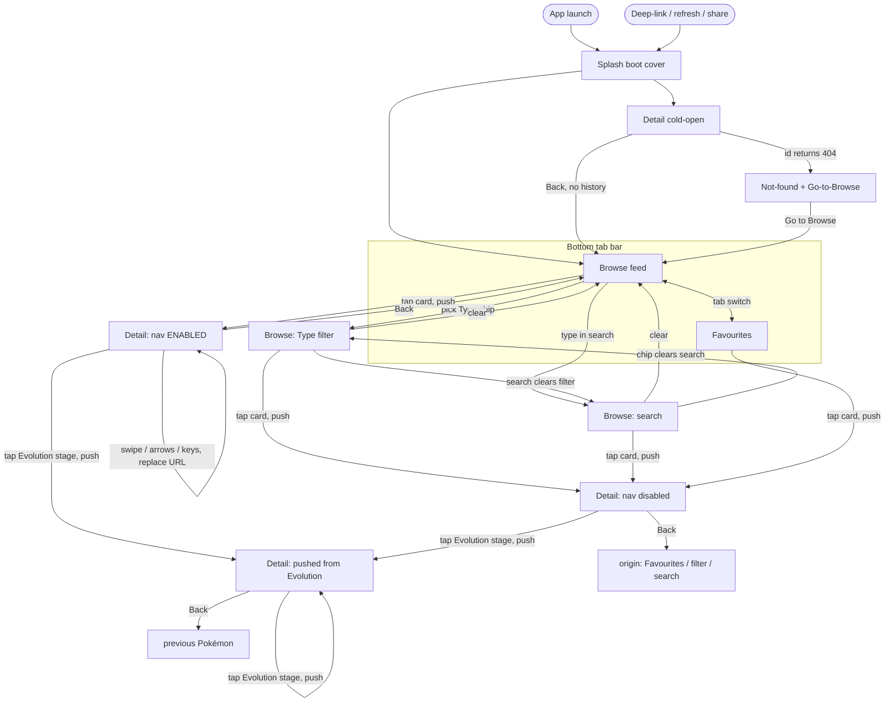

# Pokédex — UI Design

| | |
|---|---|
| **Status** | Draft for review · **rev 2 (reference-style pivot)** |
| **Date** | 2026-09-27 |
| **Author** | jems.p14@gmail.com |
| **Type** | Take-home assessment |

> The *what/why* lives in [`PRD.md`](./PRD.md); the technical *how* in
> [`ARCHITECTURE.md`](./ARCHITECTURE.md); terminology in [`CONTEXT.md`](../CONTEXT.md).
> This doc is the **visual & interaction design** — the shared context behind the Figma
> mockup. Every choice traces back to a PRD use case, acceptance criterion (AC), or the
> [State Matrix](./PRD.md#61-state-matrix) (§10).

> **Revision note.** rev 1 was grilled as *clean modern utility* (calm neutral frame, subtle
> Type wash, Type-coloured stat bars, canonical palette, red as the sole accent). During the
> Figma build we **pivoted to the reference style** in [`reference-image/`](./reference-image/) —
> colourful and **Type-immersive**. This doc reflects the pivot; the reversed decisions are
> called out inline.

---

## 1. Design principles

**Direction: colourful, Type-immersive (reference-aligned).** The active Type *is* the
surface — full-colour detail headers and Type-coloured cards — with a soft Poké Ball watermark
motif and rounded, friendly shapes. A neutral white canvas frames it; **red is the one brand
accent** for actions. Pragmatic, not pixel-perfect (NFR-4).

- **Type drives immersion** — headers, cards, chips, stat labels take the Type colour.
- **Red is the action accent** — CTAs, active bottom-nav, and the Poké Ball centre dot only.
- **The Pokémon is the hero** — artwork sits large and overlapping; chrome stays quiet.
- **Every state is designed** — loading, empty, error, offline, not-found are first-class (§9).
- **Light-first** — light mode is fully designed; dark mode inherits from Ionic defaults,
  verified at build (not mocked).
- **Ride the framework** — a thin custom token layer over Ionic's CSS variables.

---

## 2. Colour system

### 2.1 Brand accent & neutrals

Red is the **single brand accent**; the Type colour carries the personality (§2.2–2.3).

| Token | Value | Use |
|---|---|---|
| `accent` | `#DC0A2D` | app title, search field (outline + Poké Ball icon), primary CTA, active bottom-nav, favourite ♥, sprite-flip icon, Poké Ball centre dot |
| `stat` | `#F5606B` | stat-bar fill (single red-coral, all bars) |
| `ink` | `#1D1D2E` | headings, primary text |
| `muted` | `#74748C` | secondary text, section labels |
| `subtle` | `#9AA0AE` | placeholder text, inactive icons |
| `bg` | `#FFFFFF` | app / sheet background |
| `surface` | `#EFEFF3` | search pill, chip “All”, stat tracks |
| `border` | `#EDEDF2` | hairlines, dividers |
| `disabled` | `#B8B8C4` | inactive tab label |

### 2.2 The 18 Type colours (softer / pastel)

Source of truth for the detail header, Type-coloured cards, `TypeBadge`, the filter chips, and
the stat-tab **labels**. Softer than the canonical set to match the reference. The **label**
column applies when the hue is used as a *solid* fill (badge / chip / secondary pill); light
hues take dark text for WCAG AA. *(Verify contrast against the final hues in build.)*

| Type | Hex | Label |
|---|---|---|
| Normal | `#AAA67F` | black |
| Fire | `#F57D31` | white |
| Water | `#6493EB` | white |
| Electric | `#F9CF30` | black |
| Grass | `#74CB48` | white |
| Ice | `#9AD6DF` | black |
| Fighting | `#C12239` | white |
| Poison | `#A33EA1` | white |
| Ground | `#DEC16B` | black |
| Flying | `#A891EC` | black |
| Psychic | `#FB5584` | white |
| Bug | `#A7B723` | black |
| Rock | `#B69E31` | black |
| Ghost | `#70559B` | white |
| Dragon | `#7037FF` | white |
| Dark | `#75574C` | white |
| Steel | `#B7B9D0` | black |
| Fairy | `#E69EAC` | black |

*(The Figma **Foundations** page now uses this palette; each colour is grouped as
`Swatch ·`/`Token ·`.)*

### 2.3 Where Type colour goes

| Surface | Type colour | Note |
|---|---|---|
| **Detail header** | **Full** — solid *primary* Type fill, Poké Ball watermark | Type already fetched for Detail (free) — *rev 1 was a subtle wash* |
| **Browse card** | **Full** — solid *primary* Type fill | Type from a **background map** ([ADR 0006](./adr/0006-background-type-map-for-coloured-browse-cards.md)); revisits **NFR-1 / S5** (see PRD note) |
| **Favourites card** | **Full** | `Favourite` stores `types[]` locally — no fetch (AC-4.6) |
| **Filter chips** | **Solid** hue (the “All” chip is neutral `surface`) | the colours' semantic home |
| **Stat bars** | **Labels only** (bars are `stat` red) | *rev 1 filled bars with Type colour* |
| **Detail active tab** | **Text + underline** in the primary Type colour | inactive tabs `disabled` |

### 2.4 Type pills (on the coloured header)

- **Primary** type pill → **translucent white** (`#FFFFFF` @ 25%) — the header already *is*
  that colour, so it needn't repeat it.
- **Additional** type pill(s) → **solid** in their own Type colour with the per-type label.

---

## 3. Typography

**System font stack** — San Francisco (iOS), Roboto (Android), `system-ui` (web); Ionic's
default. Zero webfont load, native per platform (NFR-7). *Figma proxy: SF Pro / Inter.*

| Role | Size / weight | Notes |
|---|---|---|
| Detail name | 26–28 / 700 | white, on the coloured header |
| Card / section heading | 14 / 600 | card name (white on colour); section headings |
| Number | 11–12 / 700 | `#0025`; muted on neutral, translucent-white on colour |
| Section label | 12–13 / 600 | uppercase, tracked (spec labels, stat labels use Type colour) |
| Body | 14–15 / 400 | line-height 1.5 (description) |
| Caption | 11–12 / 400 | `muted` |

---

## 4. Spacing, radius, elevation, motion

- **Spacing (4-based):** `4 · 8 · 12 · 16 · 20 · 24 · 32 · 40`
- **Radius:** card `16` · header/sheet `24` · badge `6` · button `22` (pill) · chip/pill `full`
- **Elevation:** cards use a **Type-tinted** soft shadow (e.g. `0 8px 16px rgba(type,.35)`);
  neutral surfaces use a plain soft shadow (`0 4px 16px rgba(0,0,0,.08)`).
- **Motion (subtle, functional):** durations `fast 120ms · base 200ms · slow 300ms`; easing
  `cubic-bezier(0.4, 0, 0.2, 1)`.
  - page push (~250ms) · tab crossfade 150ms · stat bars grow-in on tab open · favourite ♥
    scale pop 120ms · sprite flip crossfade · skeleton shimmer · swipe follows finger, snaps.

---

## 5. Layout & responsive grid

Mobile-first (NFR-4). **Content max-width is capped at the tablet width (768)** — on wider screens
the content column is **centred** with side margins (desktop is *not* stretched full-bleed, which
read as empty). Within a row, cards **stretch to fill** the width, with fixed internal anchors:
**sprite centred · number top-right · Poké Ball bottom-right · name bottom-left**.

| Breakpoint | Artboard | Grid |
|---|---|---|
| mobile | 375 | 2 columns |
| tablet (≥768) | 768 | 4 columns, cards stretch to fill |
| desktop (≥1200) | 1280 | same content, **centred at 768 max-width** |

- **Browse tab:** title → **capped** search bar → Type chip row → grid.
- **Favourites tab:** title → search bar (narrows the saved set) → Type chip row → grid; the
  empty state omits the search (nothing to search yet).
- **Detail:** mobile — full-colour top section (header) + tap-switched tabs on a white sheet
  below. On **≥768** it becomes a **two-pane split**: the Type-colour hero (artwork, name, number,
  pills, back/favourite — larger artwork, extra Poké Ball highlights) on the **left**, the tabs +
  active tab body on the **right** where the content sits **directly on the white panel** (no inner
  card). On **desktop** that 768 two-pane is a **centred floating card** on a neutral canvas.
- **Navigation:** full-width bottom tab bar (Browse · Favourites).

---

## 6. Components

Each maps to a component named in [ARCHITECTURE §6](./ARCHITECTURE.md#L162). All are built in
the Figma **Components** page as named groups.

### PokéBall (motif)
One reusable filled Poké Ball: grey ball `#CCCCD6`, white band + button, and a **contextual
centre dot** — grey (default), **`accent` red** (empty-state emphasis), or faint white (as a
watermark). Used as the header/card **watermark** and the empty-state **icon**.

### PokemonCard
**Type-coloured** rounded card (radius 16), Type-tinted soft shadow, faint Poké Ball watermark
**bottom-right**. **Number** top-right (`#0025`, zero-padded to 4; Forms show raw id e.g.
`#10001`), **artwork** centred (official illustration, lazy-loaded), **name** (white, 14/600)
bottom-left. Cards **stretch to fill** the row (§5). Whole card is the tap target; placeholder on
image error (AC-3.3). *Type colour needs Type per card — see §2.3 / PRD note (NFR-1 / S5).*

### TypeBadge / Type pill
- On the coloured header → **pills** (§2.4): primary translucent-white, extras solid.
- On neutral surfaces → **solid** Type-colour pill, per-type label (§2.2), title-case.

### TypeFilter (chips)
Horizontally-scrolling row: a leading neutral **“All”** chip (`surface`) + solid Type-colour
chips. Selected = filled + ring. One tap to filter; selecting a Type clears any active search
(alternative modes). Reused on Favourites for per-Type filtering (AC-4.6).

### SearchBar
Rounded pill with a **red (`accent`) outline** and a small **red Poké Ball icon**; placeholder
“Search Pokémon by Name or Dex Number”. **Capped width** (not full-bleed). States: **disabled +
hint** while the index loads (AC-6.5); **“search unavailable — retry”** if the index fetch fails
(AC-6.6). Typing clears the active Type chip.

### DetailHeader (fixed top · auto-layout frame `Detail Layout`, 360 wide on mobile)
A vertical stack over a **full-bleed Type-colour panel** that fills the whole screen behind the
content (**square — no corner radius**, soft Type-tinted shadow `0 10 24 @35%`). Two faint
**Poké Ball highlights** texture the panel (`#F1F1F1` @20%, a
boolean-**Subtract** shape so the band/button are true negative space): a large one top-right
(~124px, ~−18°) and a small one lower-left (~83px, ~31°, bleeding off-edge). The taller
tablet/desktop hero adds a couple more (a big one bleeding off the bottom-left + a mid-right ball)
for richer texture.

Stack, top → bottom (side padding **16** unless noted):
1. **Header row** (h 59) — **Back `←`** left, **Favourite `♡`** right (both white, 22).
2. **Top Info** — **Title Row**: name (white, 28/700) left · **number** (`#001`, white, 15/700)
   + **genus** (white @90%, 13/500) right-aligned. **Type pills** 16px below (gap **8**): primary
   **translucent-white** pill (`#FFFFFF`@25%, radius **14**, h **28**), extra types **solid**
   (§2.4).
3. **Sprites** — official **Artwork** (~**172**px, centred) with the **sprite-flip** control at
   its lower-right, sitting over the artwork: a **30px** translucent-white circle
   (`#FFFFFF`@30%, soft shadow) + a ghosted `⇄` **vector** (`#FFFFFF`@50%). Swaps front/back
   Sprite (**AC-2.4**; hidden when there's no back Sprite).
4. **Tabs bar** — a **white rounded bar** (h **50**, radius ~16, inner padding **16**) floating on
   the panel: **active tab** in Type colour + underline (15/700), others `disabled` `#B8B8C4`
   (15/500).
5. **Content card** — a **white bottom sheet** below the tab bar (**gap 16**): **rounded top
   corners only** (radius 24), running to the bottom of the screen (so the Type panel reads as a
   full-bleed backdrop behind it), padding **24** sides / **20** top. Hosts the active tab body
   (About / Base Stats / Evolution); its height follows the tab's content.

*Spacing summary:* panel full-bleed (square) · tab-bar radius ~16 · content sheet top-radius 24 ·
pill radius 14 (h 28, gap 8) · side padding 16 (content card 24) · vertical gap 16 · sprite-flip 30px.

### Detail tabs
Ionic segment styled as a **white rounded tab bar** (separate card above the content card, per
DetailHeader): **About · Base Stats · Evolution** (Moves is out of scope, §9). Opens on **About**.
Active tab = **primary Type colour** text + underline; inactive = `disabled`. Tap-switched only —
**horizontal swipe is reserved for Pokémon navigation** (UC-2).

### StatBar
Type-colour **label** (right-aligned) + numeric value + track (`surface`) + **`stat` red fill**
(single colour, all bars). Six bars (HP, Attack, Defense, Sp. Atk, Sp. Def, Speed) + a **Total**
row (AC-2.2). Fills grow-in when the tab opens.

### EvolutionStage / EvolutionTab
Laid out **one evolution step per row** — *from* stage → arrow (carrying the **evolution
method**, e.g. *Lv. 16*) → *to* stage — stacked vertically, so **branches wrap** and there's
never a horizontal scroll that would steal the swipe (AC-2.10). Each stage is image + name + dex
number; the current Pokémon is highlighted with an `accent` ring. Tapping a
stage **pushes** that Pokémon's Detail (AC-2.8). Empty state: “This Pokémon does not evolve”
(AC-2.9).

### PokemonNav
Prev/next on the Detail header: **swipe** (touch), circular translucent-white **‹ / › chevron
buttons flanking the artwork** (mouse), **←/→** (keyboard). Disabled at first/last (AC-2.13); loading while the index isn't
ready (AC-2.13b). **Enabled only from the main Browse feed** — disabled from Favourites, an
active Type filter, or search (AC-2.15) — when disabled the ‹ › are shown **dimmed** (a
`PokemonNav · states` swatch documents enabled vs disabled).

### StateScreen
One template for every messaging state: centred **filled Poké Ball** icon (red centre dot) +
short **message** + **action button** (`accent` red — Retry, or Go-to-Browse for 404).
Icon/copy/button swap per state.

### Skeletons
`SkeletonCard` (grey block for artwork + text lines) and `SkeletonDetail` (header block +
tab-content lines), matching the real shape, with a shimmer (AC-1.1 / AC-2.5).

### App chrome
- **Top bar:** the coloured Detail header carries its own Back; Browse/Favourites show a bold
  **red (`accent`) title** (“Pokédex”).
- **Bottom tab bar:** **full-width bar with a red (`accent`) top border**; **Browse** (Poké Ball
  icon) · **Favourites** (♥). Active item `accent` red, inactive `disabled`.

### SplashScreen (app boot · not an Angular component)
A **brand / boot cover** shown while the app shell starts — **not a data gate**. It gates on
**nothing**: it hands straight off to the **Browse skeleton** (which owns its own loading), so it
has **no error / offline / timeout** state — it can't fail, because it isn't waiting on anything.
Built at **375** and **1280** (`Splash · 375` / `Splash · 1280`).

- **Field** — full-bleed **`accent` red** (`#DC0A2D`): the one place red fills the whole surface.
  Because red is a **brand** colour (not a theme *surface*), the splash is the **same in light and
  dark** — no dark variant.
- **Watermarks** — two faint **Poké Ball** ghosts bleeding off opposite corners — the same
  boolean-**Subtract** `#F1F1F1`@20% motif as the DetailHeader panel (§6 DetailHeader), reused from
  that build.
- **Hero** — a centred **classic red/white Poké Ball** (~128px), built like the app-404 ball (red
  top, white lower half, `#22222E` band + button), with an **8px `#22222E` outline** so its red top
  separates cleanly from the red field.
- **Wordmark** — **"Pokédex"** below the ball (white, 34/700).
- **Subtitle** — **"Warming up the Pokédex…"** (white @70%, 14/500) — on-brand flavour, *not*
  "Loading…/Please wait" (it isn't a wait or a gate).
- **Motion** — the hero ball **spins** (one turn per 1.2s, linear) on the **web overlay**; it
  holds still under `prefers-reduced-motion`. The native splash is a static image and can't
  animate, and it fades out together with the web overlay, so the spin is a web-only touch.
  Otherwise the only movement is the **exit**.
- **Wide screens** — the cluster stays **fixed-size, centred**; the red field simply grows around it
  (matches native letterboxing). **768 is omitted** — visually identical to these two.
- **Exit** — a ~**600ms** minimum-display floor, then a ~**200ms fade** into the Browse skeleton
  (prevents a flash on fast/warm loads; the fade is a *transition*, and the spinning ball is brand
  flourish, not a progress indicator, since the cover waits on nothing).

**Delivery — one design, two mechanisms.** *Native:* `@capacitor/splash-screen`
(`launchShowDuration` + `SplashScreen.hide({ fadeOutDuration })`). *Web* (no native splash): an
HTML/CSS overlay in `index.html` that CSS-fades before removal — otherwise the browser flashes a
blank page before Angular boots.

---

## 7. Pages flow

How a Trainer moves screen-to-screen. Three pages — **Browse**, **Favourites**, **Detail** —
with Browse holding three feed *modes* (browse / type / search). The nav rules come from
[ARCHITECTURE §7](./ARCHITECTURE.md#L176) and UC-2's entry/back ACs.

**Flow rules & references**

| From | Action | To | Behaviour | Ref |
|---|---|---|---|---|
| Launch / deep-link | cold start | Splash → target | boot cover (~600ms floor + ~200ms fade), then Browse or Detail cold-open | §6, NFR-2 |
| Launch | open app | Browse | default route; index loads at startup | UC-1, NFR-2 |
| Browse ↔ Favourites | tap tab | the other tab | state preserved | §7 IA |
| Browse | pick Type chip | Browse (Type) | grid filtered; search cleared | AC-5.1, AC-5.4 |
| Browse | type in search | Browse (search) | grid narrows; Type filter cleared | AC-6.1, AC-6.4 |
| Browse (main) | tap card | Detail | **push**; Pokémon nav **enabled** | AC-2.11 |
| Favourites / filter / search | tap card | Detail | **push**; nav **disabled** (Back to that set) | AC-2.15 |
| Detail (nav) | swipe / arrows / ←→ | adjacent Detail | URL **replaced**; ±1 prefetched | AC-2.11–2.14 |
| Detail | tap Evolution stage | Detail | **push** (Back returns to the stage jumped from) | AC-2.8 |
| Detail | toggle Favourite | (stays) | saved with Type(s); Favourites reflects it | AC-4.1, AC-2.17 |
| Detail (any) | Back | origin / prev / Browse | falls back to Browse if no history | AC-2.16 |
| Deep-link | open `/pokemon/:id` | Detail | cold-open; index may still be loading | AC-2.13b, AC-2.16 |
| Deep-link | id 404 | Not-found | "not found" + Go-to-Browse (no Retry) | AC-2.18 |
| any data view | connection lost | offline state | auto-recovers on reconnect (stays in place) | NFR-3 |

---

## 8. Figma pages roadmap

The Figma file's page structure and the order we build it.

**Page structure** (Figma)
1. **01 · Foundations** — colour tokens (rev-2 pastel palette + red accent), Type swatches
   (each grouped `Swatch ·`/`Token ·`), type scale.
2. **02 · Components** — every component in §6 (reference-style, named groups).
3. **03 · Screens** — *all* screen artboards: the Splash boot cover (375 / 1280), Browse
   (375 / 768 / 1280), Detail, Favourites, and the §9 states.

**Build order**

| Step | Deliverable | Covers | Status |
|---|---|---|---|
| 1 | Foundations (tokens + Type swatches) | design system | **built (rev-2 palette, grouped)** |
| 2 | Core components | reuse everywhere | **built (reference style)** |
| 3 | Browse happy path × 3 breakpoints | UC-1, NFR-4 | **built (375 / 768 / 1280)** |
| 4 | Detail happy path (About → Base Stats → Evolution) | UC-2, UC-3 | **built** — mobile 3 tabs + **two-pane About** at tablet 768 & desktop 1280 (centred card) |
| 5 | Favourites (grid + empty) | UC-4 | **built (grid + "No favourites" empty state)** |
| 6 | **All states** — skeletons, empties, errors, offline, 404 | §6.1 State Matrix | **built** — Browse loading (skeleton grid) / error / offline / load-more error · Search "no matches" / "unavailable" · Detail 404 / SkeletonDetail / "does not evolve" · Favourites empty / "No [Type] favourites" |
| 7 | **Splash boot cover** (red-immersive · 375 / 1280) | app startup | **built** — hero Poké Ball + wordmark + "Warming up the Pokédex…"; spinning hero ball (web); ~600ms + fade exit |
| 8 | (optional) prototype wiring for a click-through of §7 | flows | pending |

---

## 9. State artboard inventory

Directly from the [State Matrix](./PRD.md#61-state-matrix) — so no state is orphaned. Content
scope is the PRD's: **no Moves tab, no Breeding block, no Type-defences grid** (out of scope).

- **Browse:** skeleton grid (first load) · bottom "load more" spinner · full-view first-load
  error + retry · inline "couldn't load more" · offline · Type-filtered grid · Type-filter
  skeleton · Type fetch error + retry · search-narrowed · "No matches" · search index-loading
  (bar disabled) · "search unavailable".
- **Detail:** skeletons (mobile + two-pane **tablet/desktop**) · whole-page core error + retry · per-tab (description / Evolution)
  error + retry · "does not evolve" · **404 not-found** — reuses the detail layout as a **mystery
Pokémon** (desaturated panel, `???` / `#—` / Unknown, big "?" avatar) + message + Go-to-Browse ·
favourited vs not ·
  nav enabled vs disabled vs loading · front/back Sprite flip · branching Evolution (wrap).
- **Favourites:** grid · "No favourites yet" · Type-filtered · "No [Type] favourites" ·
  storage-read failure + retry.
- **App-level 404 (Page not found):** a general route/URL error page (distinct from the *Pokémon*
  not-found detail state) — built mobile / tablet / desktop. Centred **`4` · Poké Ball · `4`**
  (the Poké Ball as the “0”, brand red), **"Page not found"**, playful copy ("slipped away into the
  tall grass"), and a **Back to Browse** button. Wired to the router's wildcard route.
- **App boot (Splash):** a brand / boot cover during startup (§6 SplashScreen) — full-bleed red,
  Poké Ball watermarks, centred hero ball + **"Pokédex"** + **"Warming up the Pokédex…"**. **No
  failure state** — it gates on nothing and hands to the Browse skeleton. Native via
  `@capacitor/splash-screen`, web via an `index.html` overlay; ~600ms floor + ~200ms fade exit.
  Built 375 / 1280 (768 omitted — identical centred cluster).

---

## 10. Traceability (PRD → design)

| PRD | Realised in this design |
|---|---|
| UC-1 Browse + infinite scroll | §5 grid, PokemonCard (Type-coloured), SkeletonCard, Browse states (§9) |
| UC-2 Detail (tabs + swipe) | DetailHeader (full colour), Detail tabs, StatBar, EvolutionTab, PokemonNav, §7 flow |
| UC-3 Images | Card artwork, DetailHeader Artwork + **sprite-flip (⇄) front/back** (AC-2.4), placeholder |
| UC-4 Favourites | Favourites tab, chip filter, Favourite ♥, empty/error states |
| UC-5 Type filter | TypeFilter chips, §2.3 colour rules, Type-filter states |
| UC-6 Search | SearchBar (grey pill, + disabled/unavailable states), search states |
| NFR-1 Smooth scroll | **Amended** — Type-coloured cards need Type per card; mitigated by cache/batch (see PRD note) |
| NFR-3 States | StateScreen (Poké Ball icon) + Skeletons + §9 inventory (every Matrix cell) |
| NFR-4 Responsive | §5 breakpoints; content capped at 768, cards stretch to fill |
| NFR-5 Accessibility | per-type label contrast (§2.2), alt text, keyboard nav (PokemonNav) |
| *(design-added)* App boot cover | **SplashScreen** (§6) — native `@capacitor/splash-screen` + web `index.html` overlay; brand moment over startup, hands to the Browse skeleton (no data gate) |
